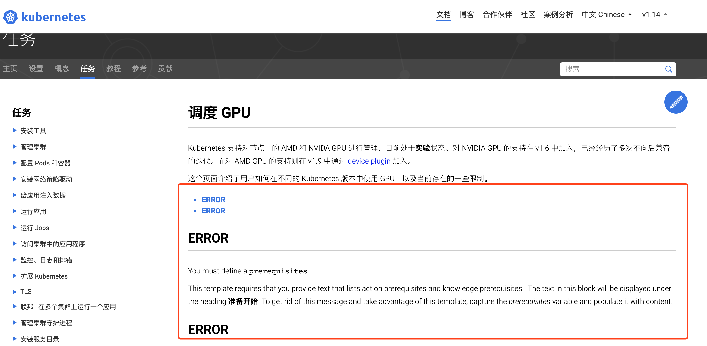

# K8SMeetup 翻译流程与翻译校稿规范

## 翻译进程主要有两个阶段：

### 前情概要

翻译项目在 `2017/7/17` 启动至 `2018/4/15` 都是基于上游 `Master` 分支去翻译，当时上游的文档是基于 `jekyll` 构建，无法提供多语言的支持。为此从 `2018/4/15` 开始，为期三/四个月，将文档库由 `jekyll` 切换至 `hugo` 构建，由于同步信息的时效比较差，翻译项目陷于停滞。由于迁移和翻译基于 `master` 分支的副作用，造成很多翻译过的文档无法合入。

基于 `KUBECON` 在上海的契机, 多语言版本提上日程，原有的任务领取方式已经不能满足要求，而且`Google 任务表` 领取也不方便，因此目前新的流程应运而生。

经社区成员讨论一致决定基于目前最新的 `release-1.14` 分支作为基准翻译分支，大家提交 `PR` 时,不要选择 `Master` 分支。

### 第一阶段：基于 [website](https://github.com/kubernetes/website) 仓库的 `master` 分支进行翻译

主要的上游工作仓库是 [kubernetes-docs-zh](https://github.com/kubernetes-retired/kubernetes-docs-zh)

- 时间区间：2017/07/17 - 2018/4/15 
- 成果输出：翻译图表 [DashBoard](https://k8smeetup.github.io/chart)，附每周的翻译[文章汇总](report/contribution-stage1.md)。
- 任务领取：基于 Google Docs [任务表]((https://docs.google.com/spreadsheets/d/1k49XTmtEkhjeh9M118fwwcXVfHvCe-DCy6sVVRQAxBk/edit#gid=1294143213))协作

### 第二阶段：基于 [website](https://github.com/kubernetes/website) 仓库的 relese-1.1x 分支进行翻译

主要的上游工作仓库是 [website](https://github.com/kubernetes/website)

- 时间区间：2018/11/13 - 至今
- 成果输出：
    - [Merged PR 列表](https://github.com/kubernetes/website/pulls?utf8=%E2%9C%93&q=is%3Apr+is%3Amerged+label%3Alanguage%2Fzh+)
    - 进度展示图 [DashBoard](https://k8smeetup.github.io/k8s-official-translation/index.html)
    - 每周的[翻译文章汇总](report/contribution-stage2.md)
    - 每周的[更新文章汇总](report/contribution-stage2-update.md)
- 任务领取：全部基于 Github 即有功能实现，通过 [website-tasks](https://github.com/k8smeetup/website-tasks) 仓库实现

## Step1. 准备工作

首先您需要有一个 `GitHub` 账户，加入 [Slack ](https://k8s-zh-slack-invite.herokuapp.com/) 或 k8smeetup 微信群之后，再申请加入 [k8smeetup 组织](https://github.com/k8smeetup)，我们会基于您的 Github 账户，向您邮箱里发送组织邀请，需要您配合完成邀请确认，只有加入 `k8smeetup` 组织您才可以领取翻译任务。(可选项:提供微信账户，也会邀请您加入我们的微信群，方便即时沟通，随时响应)。

其次当您完成翻译后，需要向 [website](https://github.com/kubernetes/website) 提交您的 `PR` 也需要您完成 [CNCF/CLA 会员](https://github.com/kubernetes/community/blob/master/CLA.md) 协议的签署。

归纳一下前期需要的参与准备工作：

- 注册自己的 `Github` 账户
- 申请加入 [k8smeetup 组织](https://github.com/k8smeetup)/加入微信群(群主K8S小助手微信联系方式：K8sMeetup中国- ID：kubernetes-china)
- 签署 `CNCF/CLA` [会员协议](https://github.com/kubernetes/community/blob/master/CLA.md)
  - [k8s-bot命令参考](https://prow.k8s.io/command-help)

### 提示信息

- 翻译流程
  - 讲解译者如何参与 `Kubernetes` 中文化文档翻译的过程
- 校稿规范
  - 讲解如何预定翻译文档的校验，以提升翻译质量
  - 提供版本控制与翻译文件更新样例，提示如何更新翻译文件
- Kubernetes 对应的翻译[术语表](trans-glossary.md)
  - 建议译前阅读

## Step2. 翻译流程

> 注意：新的任务领取流程基于 Github issue 实现

 使用 [website-tasks](https://github.com/k8smeetup/website-tasks/issues) 进行任务分发有如下的优点：

1. 良好网络支持，不需要自备 VPN
2. 易于管理(基于 slack 直观的任务管理)
3. 简易的任务领取(基于 Github 的 bot 自动化 issue 任务的领取)
4. 便于译者更新文档(issue 可以对文档的 diff，直观的看到变更效果）
5. 可以增量的版本迭代(基于 bot 做文档差异化增量迭代，提升翻译效率 - `需开发`)
6. 多语言适配且不需要绘制统计图表 (基于 Github 自有的统计能力)

注：所有的翻译文件，都要保留原文，一段英文，一段中文，且中英文间隔不要太长，以方便大家 `review`，保证翻译质量。

> 再次提醒: 为具备领取任务的权限，首先要加入 [k8smeetup 组织](https://github.com/k8smeetup)，才能进行其它后续工作。

### 任务浏览

访问[任务列表](https://github.com/k8smeetup/website-tasks/issues)，会看到如下图所示的 Issue 列表：

当前有 1.12、1.14 两个版本的 issue，文档包含标准帮助和博客文档..

- 搜索 1.14 版本标准文档: `is:open is:issue label:priority/P0 label:version/1.14`  - 建议优先翻译此文档
- 搜索 1.14 版本博客文档: `is:open is:issue label:priority/P1 label:version/1.14`


Issue 标签目前分为几类：

- 任务状态
    - `welcome`: 未经确认，暂时属于无效任务。
    - `pending`：待认领任务。
    - `translating`：已认领任务，正在翻译。
    - `pushed`：该任务已生成 PR，正在进行 Review。
    - `merged`：该任务相关 PR 已合并，任务完成。
- 优先级：`priority/P0`、`priority/P1` 等等。
- 版本标识：`version/1.12`、`version/1.13` 等等。
- 文档类型
    - `doc/accessory`：辅助文档。
    - `doc/core`：核心文档。

可以简单的通过点击标签来进行过滤。或者也可以参考 [github 查询语法](https://help.github.com/articles/searching-issues-and-pull-requests/)，来完成更复杂的查询，下面举两个例子：

- 搜索所有 1.14 版本的待认领任务：`is:open is:issue label:priority/P0 label:version/1.14 label:pending`
- 搜索所有指派给 `fleeto` 的未完成任务：`is:open assignee:fleeto`

### 任务认领

通过浏览和搜索之后，可以找到未经认领的待翻译文档来进行认领。认领方式很简单，在该 Issue 的 Comment 中回复：`/accept` 即可，稍候片刻，会看到 Bot 将该 Issue 分配给你，并把任务状态从 `pending` 修改为 `translating`。如此一来就可以开始翻译了。

> 注意：同一译者，只能保持三个 `translating` 状态的 Issue，超过数量无法继续认领。

### 任务提交

如果已经翻译完成，提交 PR 之后，就可以回到这一 Issue，输入指令 `/pushed`，提示系统该任务的翻译阶段已经完成，进入 Review 环节。Bot 会将这一 Issue 的状态从 `translating` 转换为 `pushed`。

### 任务完成

在任务相关 PR 完成合并之后，可以在 Issue 中输入指令 `/merged`，Bot 会设置 Issue 状态为 `finished`，并关闭 Issue。


#### 参与翻译前必读 

分支管理主要是提供多任务翻译的参考指引，方便译者借鉴使用。

[翻译过程中的分支管理](branching-strategy.md)主要讨论怎么做分支策略。

## Step3. Kubernetes 文档校对

### 为什么要进行校对

典型的例子：https://github.com/kubernetes/website/pull/14897

首先要在线预览一下，自检一下格式显示是否正确：

拿此例来说, 对应的预览地址：https://deploy-preview-14897--k8s-v1-14.netlify.com/zh/docs/tasks/manage-gpus/scheduling-gpus/



对比参考需要 merge 分支的原始文档：https://v1-14.docs.kubernetes.io/docs/tasks/manage-gpus/scheduling-gpus/ 

显然预览就不正确，就需要解决一下相应的问题，自检还是非常重要的一个环节..

文档初稿翻译难免会有不太理想的地方，所以我们希望能有更多人志愿参与校对工作，进一步完善 Kubernetes 中文文档。

### Kubernetes 文档的构成

Kubernetes 文档由若干 `md` 和 `html` 文档构成，翻译即是将原始 `md` 和 `html`文件中需要翻译的文字用 tag 注释包起来，然后再拷贝一份进行翻译。原始英文用符号 `<!-- -->` 注释掉，每一段英文，对应一段中文，方便其他译者 review，如下例：

```
<!--
#### Kubernetes is

* **Portable**: public, private, hybrid, multi-cloud
* **Extensible**: modular, pluggable, hookable, composable
-->

#### Kubernetes 具有如下特点:

* **便携性**: 无论公有云、私有云、混合云还是多云架构都全面支持
* **可扩展**: 它是模块化、可插拔、可挂载、可组合的，支持各种形式的扩展
```

### 翻译规范

- 翻译之前，需参考[术语表](https://docs.google.com/spreadsheets/d/1JXSdoq93J4KnXA3JTQzWvrl2ZbGOMzrWKuyPjEVpUFg/edit#gid=0)以规范翻译一致性。
- 译文中的英文与中文建议用空格分隔,可以考虑找个[自动化中英文格式化 md 的软件](https://pypi.org/project/zhlint/)
- Kubernetes 资源对象如：`Deployment`、`Service`、`ConfigMap` 等不需要翻译，尽可能用原始英文。
- 翻译的中英文间隔不宜过长，尽可能一段英文注释，一段中文翻译，可以前后对应，方便其他译者协助 review。
- 保持原始 `md` 或 `html` 格式不变，例如 **\_Server\_** 翻译成 **\_服务器\_**
- 对于长文章翻译要注意锚点链接不要移除，例如 **\[Server](#Client)** 翻译成 **\[服务器](#Client)** 锚点链接保留，但不翻译。
- `md` 代码块与代码输出内容也不要翻译
- 如果是多人合译的文章，需要同步好翻译进度

#### 格式化文档：

翻译测试文件 test.md

```bash
CronJobs有一些限制和特点。
例如，在特定状况下，一个单独的cron job可以创建多个任务。
因此，任务应该是幂等的。
查看更多限制，请参考[CronJobs](/docs/concepts/workloads/controllers/cron-jobs).
```

```bash
k8s-official-translation git:(master) ✗ zhlint check test.md
==========================================
E101: 英文与非标点的中文之间需要有一个空格
==========================================
LINE: 1
CronJobs有一些限制和特点。 [n] 例如，在特定状况下，
       -－
...................................................
LINE: 2
定状况下，一个单独的cron job可以
　　　　　　　　　－-
................................
LINE: 2
，一个单独的cron job可以创建多个任务。 [n]
　　　　　　       -－
...........................................
LINE: 4
查看更多限制，请参考CronJobs
　　　　　　　　　－-
............................

==================================================
E201: 只有中文或中英文混排中，一律使用中文全角标点
==================================================
LINE: 4
制，请参考CronJobs.
　　　　　        -
...................

➜  k8s-official-translation git:(master) ✗ zhlint fix test.md
CronJobs 有一些限制和特点。
例如，在特定状况下，一个单独的 cron job 可以创建多个任务。
因此，任务应该是幂等的。
查看更多限制，请参考[ CronJobs](/docs/concepts/workloads/controllers/cron-jobs)。
```

最终的输出：

```bash
CronJobs 有一些限制和特点。
例如，在特定状况下，一个单独的 cron job 可以创建多个任务。
因此，任务应该是幂等的。
查看更多限制，请参考[ CronJobs](/docs/concepts/workloads/controllers/cron-jobs)。
```

#### 使用统一文档格式插件 editorconfig:
[解决markdown文件行尾空格自动删除的问题](https://segmentfault.com/a/1190000007599845)
[editorconfig 样例参考](https://github.com/markdown-it/markdown-it/blob/master/.editorconfig)       

.editorconfig

```bash
root = true

[*]
charset = utf-8
end_of_line = lf
trim_trailing_whitespace = true
insert_final_newline = true

[{.,}*.{js{,*},y{a,}ml}]
indent_style = space
indent_size = 2

[*.{md,txt}]
indent_style = space
indent_size = 4
trim_trailing_whitespace = false

[Makefile]
indent_style = tab
```


### 参与规则

- 校对者只需要具备基本的 kubernetes 知识，能够理解文档中讲述的内容即可
- 校对作业以 `md/html` 为单位，但对于很大的 `md` 或 `html` 文件，也可以按主题拆分成多份
- 为了避免不必要的重复翻译或校对，翻译或校对前先在[任务列表](https://github.com/k8smeetup/website-tasks/issues)中对要翻译或校对的文件进行预定
- 预定校对作业时，以文件为单位，不建议一次预定太多，希望量力而行
- 预定了某个 `md` 或 `html` 文件并不代表别人不会同时修改此文件，所以如果克隆了`git`仓库到本地，仍然要注意及时从远程仓库同步更新
- 如果某个 `md` 或 `html` 文件的校对工作进展缓慢，或某个已校对的 `md` 或 `html`文件仍有翻译问题，可以对正在校对或已经校对过的文件进行再次校对
- 由于每个月我们会同步一次最新的版本，需要译者对自己所译的文件内容更新负责
- 有任何问题，可以发 Issues 或 在微信群里讨论

### 校对步骤

- 登录github
  如果还没有github账号，先注册一个，然后登录。
- 检查译文
  对照英文原文检查译文,可以点开对应文件的链接，对照 `md` 或 `html` 中被注释的英文原文进行检查(发现问题可以在线修改),或提交 `Comment` 给译者。
- 问题纠正
  对于译者，如果发现问题，可直接修改 `md` 或 `html`文件，对暂时不太好处理的问题可以发行issues报告。
- 状态更新
## 谢谢您!

Kubernetes 在社区参与中茁壮成长，我们非常感谢您对我们的网站和文档的贡献！
